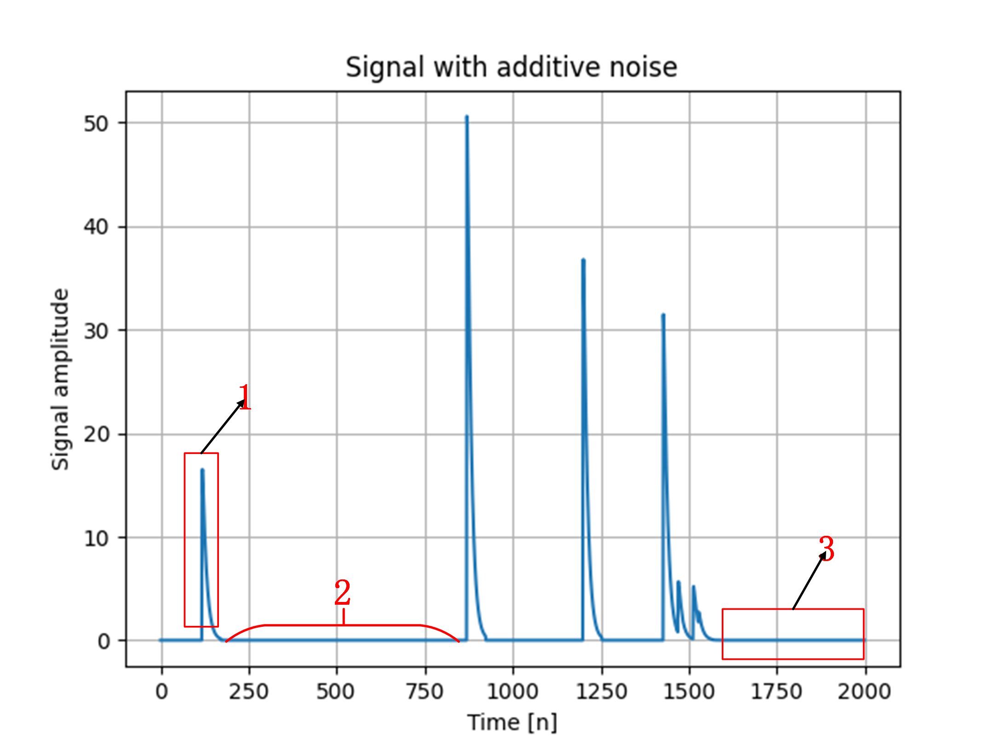
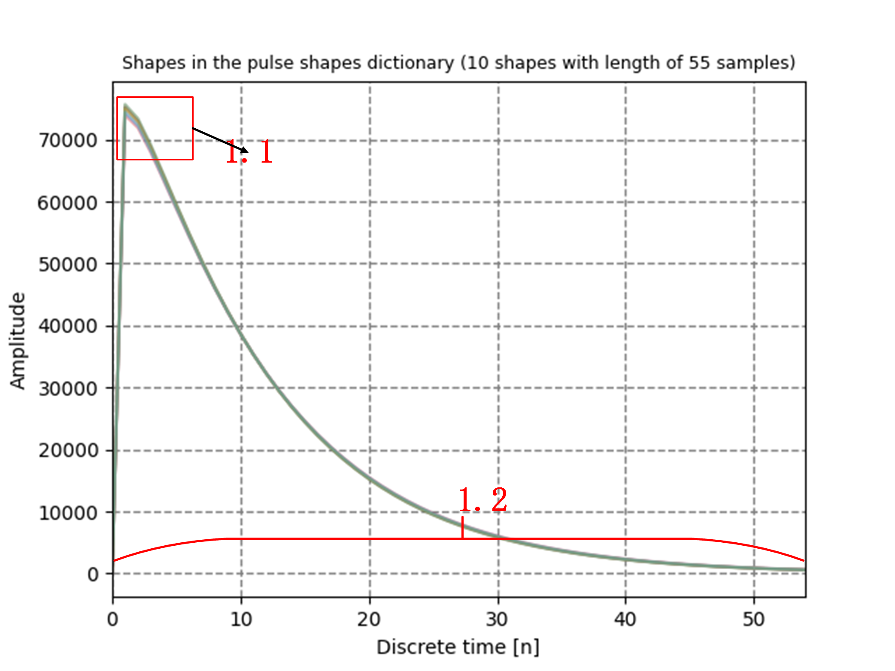
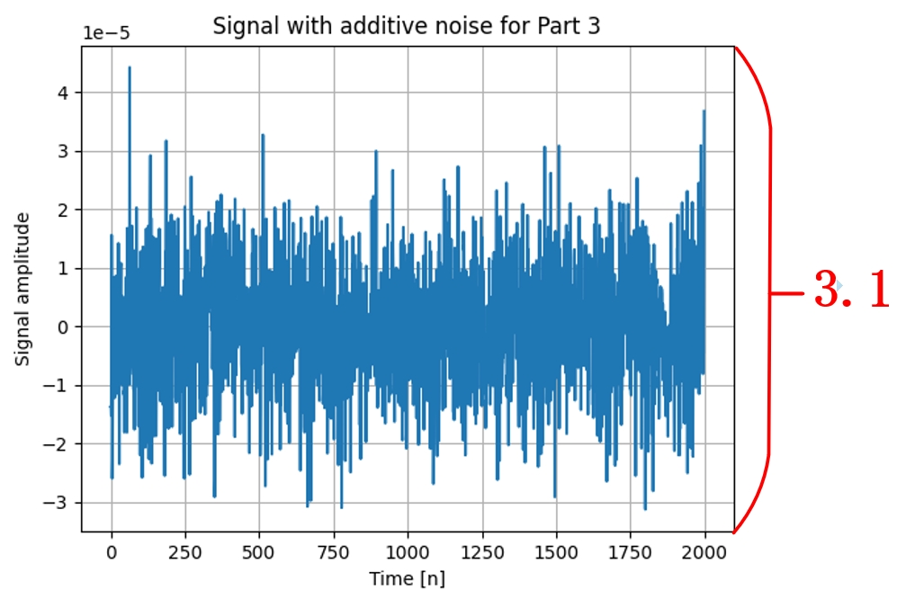
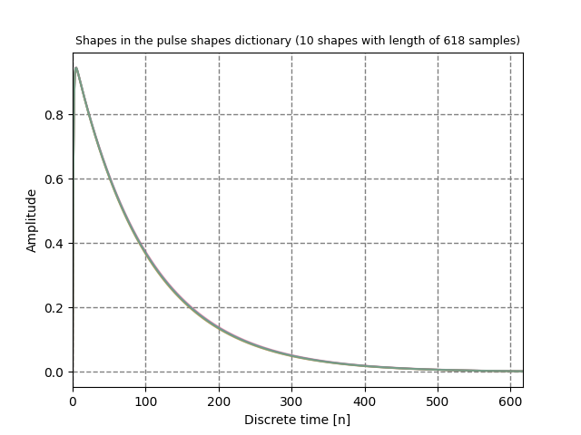
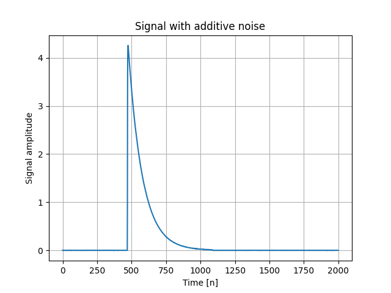

# Gamma_simulator
This is a gamma pulse simulator jointly developed by [Shamoon College of Engineering(SCE)](https://en.sce.ac.il/) in Israel and [Shanghai Advanced Research Institute](http://www.sari.cas.cn/),CAS in China.Here we will give a brief introduction to our software, including the what and why. For more specific implementation steps of the software, please refer to [Developers](./Developers) or our [paper](). Of course,**if you are a pure user, please jump directly to [Use](#use) to see how to use it**.

## Contents

- [Gamma\_simulator](#gamma_simulator)
  - [Contents](#contents)
  - [Introduction](#introduction)
    - [What is Gamma Simulator?](#what-is-gamma-simulator)
    - [Why do we creat it?](#why-do-we-creat-it)
  - [Parameter description](#parameter-description)
    - [Parameter overview](#parameter-overview)
    - [Parametric image](#parametric-image)
  - [Use](#use)
    - [Install](#install)
    - [Import](#import)
    - [Run](#run)
  - [Notice](#notice)
    - [Shape parameter](#shape-parameter)
    - [Plot setting](#plot-setting)
  - [Example](#example)
    - [result](#result)
  - [Contributors](#contributors)
  - [Known issue](#known-issue)
  - [Todo](#todo)

## Introduction
### What is Gamma Simulator?

Gamma simulator is a gamma pulse simulator with parameter customization function, you can specify the type of radioactive source and pulse count rate and other characteristics, generate pulse signals that meet the corresponding characteristics

### Why do we creat it?

The original intention of the gamma simulator was to introduce deep learning into energy spectroscopy in the later stage. The use of deep learning to process pulse signals requires that the collected pulse signals have corresponding labels, which is impossible in commercial energy spectrometer. Therefore, we used the simulator to label the pulse signals while generating them, so as to facilitate the reference of deep learning methods. At the same time, simulators can greatly reduce the manpower, material and financial resources of the signal collection process, and can be used to preliminarily test signal processing methods


## Parameter description
### Parameter overview
|**Setting Parameters:**||type|Default value|
| --- | -----------|-----------|-----------|
| verbose   | Whether to output detailed information   |bool|False |
| verbose_plots   | Whether images need to be output   |dict|None|
| source   | The simulated radioactive source   |str or dict |'Co-60' |
| signal_len   | Length of time to simulate sampling(s)   |int or float|1024|
| fs   | Analog sampling rate   |float |1 |
| lambda_value   | Analog pulse count rate(cps)   |float|0.1|
| dict_type    | Shape type model of the simulated pulse   |str|'gamma'|
| dict_shape_params   | dict shape params   |dict|Please see [Notice](#notice)|
| noise_unit   | Unit of noise   |str|'std'|
| noise   | The magnitude of noise in the given unit   |float|0.01|
| dict_size   | Shape dictionary size due to jitter   | int|100 |
| seed   | The simulated random number seed   |int|None|

**The above parameters can be set and customized by users. The chart shows the default values of parameters and draws discrete pulse signals. We also give a visual description in the [parametric image](#parametric-image). For specific parameter Settings in applications, please refer to the [example section](#examples) ,more specific parameter Settings and parameter tests are presented in the [example folder](/examples)**

### Parametric image

1. Pulse Shape: Representing the shape of each pulse, our simulator can simulate pulses of gamma shape and double exponential shape, as determined by the parameter **dict_type**, Pulse 1 is selected from the shape dictionary as shown in the image below

In the figure,1.1 represents the number of pulse shapes contained in the pulse shape dictionary, as determined by the **dict_size** parameter,1.2 represents the pulse length, including the pulse rise time and pulse fall time, which are determined by the **dict_shape_params** parameter

2. Pulse interval time: The time interval between two pulses, which is randomly generated by the Poisson process is determined by parameter **lambda_value**.More informally, lambda_value represents the average number of pulses arriving per second

3. Noise: The noise of the signal is present in every moment of the signal is determined by the **noise_unit** and **noise** parameters.If we zoom in on 3 we get the image below

Where the unit of noise is "std", 3.1 clearly represents the amplitude of the noise determined by the parameter **noise**
## Use
### Install
Make sure you have the following libraries in your environment
* numpy
* scipy
* matplotlib
* urllib  
(It doesn't matter that you don't have these, because these dependencies will be installed when you install the gamma-simulator package)

Please use the following command to install our program
```bash
pip install gamma-simulator
```
### Import
```python
from gamma_simulator.gamma_simulator import gamma_simulator
```

### Run
Step 1.Creat an instance
```python
simulator = gamma_simulator()
```
Step 2.Define parameters
```python
simulator = gamma_simulator(verbose=True,
                            verbose_plots={'shapes': True, 'signal': True},
                            source={'name': 'Co-60', 'weights': 1},
                            signal_len=1, 
                            fs=10e5,
                            lambda_value=1e4,
                            dict_type='gamma',
                            dict_shape_params={'mean1':  0.1,
                                               'std1': 0.001,
                                               'mean2': 1e5,
                                               'std2': 1e3},
                            noise_unit='std',
                            noise=1e-3,
                            dict_size=10,
                            seed=42)
```
Step 3.Creat the signal
```python
signal = simulator.generate_signal()
```


## Notice
### Shape parameter
If you are not familiar with shape parameters, use the following combination of parameters
```python
dict_type='gamma',
dict_shape_params={'mean1':  0.1,
'std1': 0.001,
'mean2': 1e5,
'std2': 1e3}
```
or
```python
dict_type='double_exponential',
dict_shape_params={'mean1': 1e-5, 
'std1': 1e-7,
'mean2': 1e-7,
'std2': 1e-9}
```
### Plot setting
Our simulator supports drawing a variety of graphs, including energy, shape, signal and spectrum.
* Energy: Ideal energy spectrum of the drawn signal source (simulator built-in database)
* Shape: Draws a dictionary set of all possible signal shapes
* Signal: When the length of the resulting signal is less than 2000, the generated signal is drawn, and when the length is greater than 2000, the first 2000 sampling points are drawn


The default option is not to draw, if you need to draw, you need to change the specified value in the parameter definition to True
```
verbose_plots={'energy':True, 'shapes': True, 'signal': True}
```
## Example

```python
from gamma_simulator.gamma_simulator import gamma_simulator
simulator = gamma_simulator(verbose=True,
                            verbose_plots={'shapes': True, 'signal': True},
                            source={'name': 'Co-60', 'weights': 1},
                            signal_len=1,  
                            fs=10e6,
                            lambda_value=1e4,
                            dict_type='double_exponential',
                            dict_shape_params={'mean1': 1e-5,  
                                               'std1': 1e-7,
                                               'mean2': 1e-7,
                                               'std2': 1e-9},
                            noise_unit='std',
                            noise=1e-3,
                            dict_size=10,
                            seed=42)
signal = simulator.generate_signal()

```
### Result


```
-- General information ------------------------------------------
Loaded spectrum for Co-60 source
Energy spectrum between 0.1 and 1665.2 keV with 8192 bins
Shapes are NOT allowed to exceed the signal boundaries
Sampling frequency: 10000000.0 samples per second
Signal length is 1 sec that are 10000000 samples
Events: 10236 (randomly generated)
Activity 10000.000 event per second and actual activity is 10236.000 events per second
Normalized lambda value: 1.000e-03 events per sample
Shape model: double_exponential
Number of double_exponential shapes in the dictionary: 10
Normal shape distribution is used.
Shape parameters: tau1 = 1e-05 sec ±1.000e-07 (100.00 samples) and tau2 = 1e-07 sec ±1.000e-09 (1.00 samples) 
Each shape has a length of 6.180e-05 sec that are 618 samples
Rise time is 4.560e-07 sec and fall time is 6.134e-05 sec
Duty cycle is given by 0.62 with theoretical pile-up probability of 0.461
Actual pile-up probability is 0.470 with 5424 non-pile-up events out of 10236 events
Noise level: ±0.001 per sample
Measured SNR: 64.92 dB
Pre-defined random seed 42 is used

Process finished with exit code 0
```

You can see more exampes and tests in [examples](./examples)
## Contributors
[Dima Bykhovsky](https://github.com/bykhov),[Tom Trigano](https://github.com/TomTrigano),[Zikang Chen](https://github.com/ZikangC)
## Known issue
  * Cannot simulate high count rates（The length of each pulse is too long）
  * The setting of the pulse length time parameter is too supervisor
## Todo 
  * Use simulators to generate datasets for deep learning
  * (Possibly) Try to give a way to set parameters so that users can customize them to their needs
