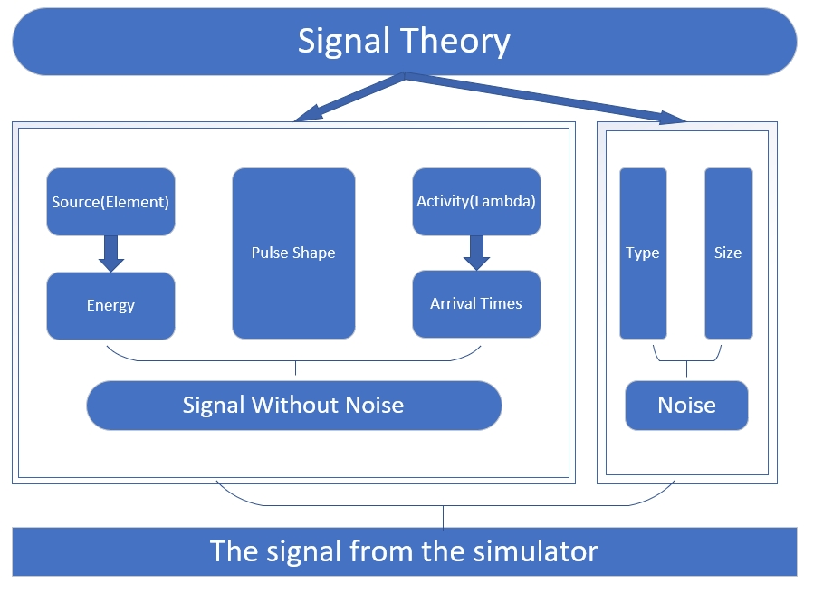
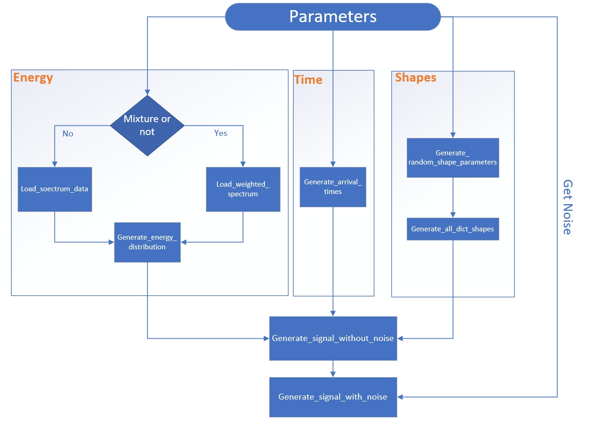
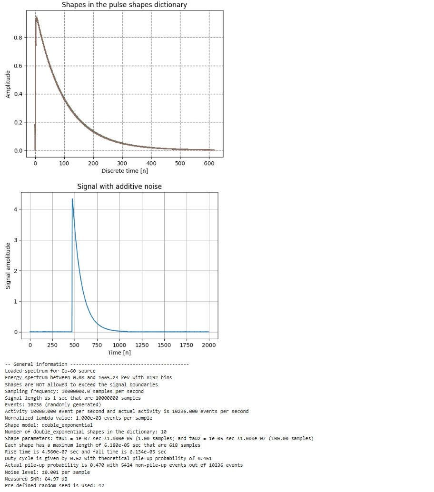
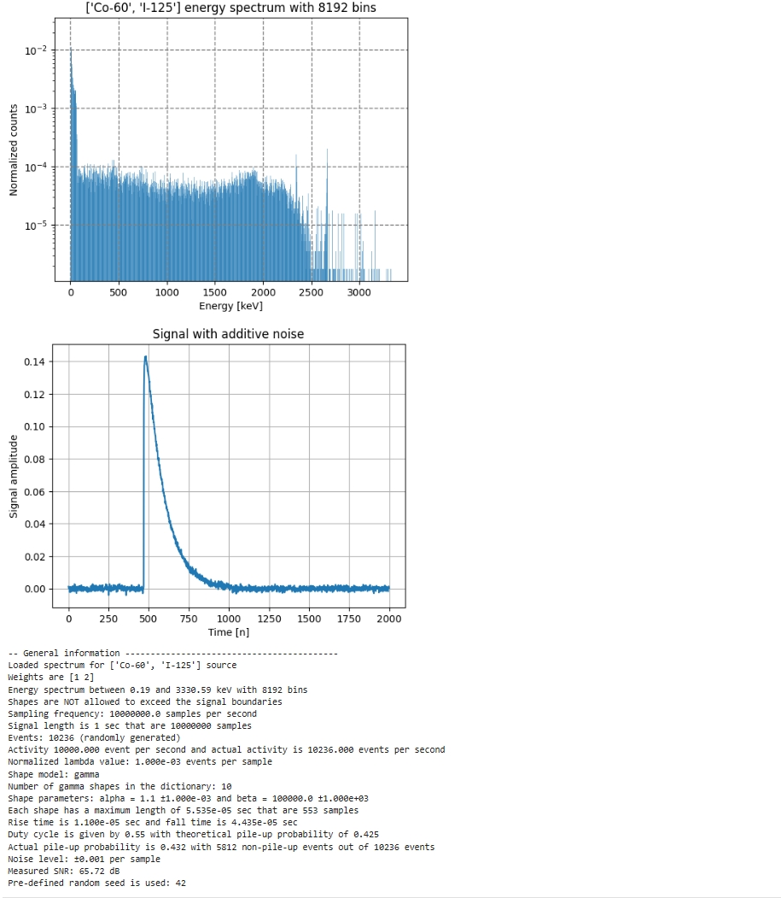

# Gamma_simulator
     
This is a gamma pulse simulator jointly developed by [Shamoon College of Engineering(SCE)](https://en.sce.ac.il/) in Israel and [Shanghai Advanced Research Institute](http://www.sari.cas.cn/) in China.Here we will give a brief introduction to our software, including the what and why. For more specific implementation steps of the software, please refer to our [paper](). Of course,**if you are a pure user, please jump directly to [Use](#Use) to see how to use it**.For any questions about the software, you can leave a message or send an email to me, I will reply as soon as possilble

## Introduction
### What is Gamma Simulator?

Gamma simulator is a gamma pulse simulator with parameter customization function, you can specify the type of radioactive source and pulse count rate and other characteristics, generate pulse signals that meet the corresponding characteristics

### Why do we creat it?

The original intention of the gamma simulator was to introduce deep learning into energy spectroscopy in the later stage. The use of deep learning to process pulse signals requires that the collected pulse signals have corresponding labels, which is impossible in commercial energy spectrometer. Therefore, we used the simulator to label the pulse signals while generating them, so as to facilitate the reference of deep learning methods. At the same time, simulators can greatly reduce the manpower, material and financial resources of the signal collection process, and can be used to preliminarily test signal processing methods

## Software structure
### Macrostructure

### Implementation structure
 
### Parameter description
Setting Parameters:
|Parameter name  |Parameter description|
| --- | -----------|
| verbose   | Whether to output detailed information   |
| verbose_plots   | Whether images need to be output   |
| source   | The simulated radioactive source   |
| signal_len   | Length of time to simulate sampling(s)   |
| fs   | Analog sampling rate   |
| lambda_value   | Analog pulse count rate(cps)   |
| dict_type    | Shape type model of the simulated pulse   |
| dict_shape_params   | dict shape params   |
| noise_unit   | Unit of noise   |
| noise   | The magnitude of noise in the given unit   |
| dict_size   | Shape dictionary size due to jitter   |
| seed   | The simulated random number seed   |

Shape parameters:
|Parameter name  |Parameter description|
| --- | -----------|
| t_rise   | rise time of the shape   |
| t_fall   | fall time of the shape   |
| shape_len   | length of the shape in samples   |
| shape_len_sec   | length of the shape in seconds   |

Events parameters:
|Parameter name  |Parameter description|
| --- | -----------|
| n_events   | number of events in the signal   |
| times   | arrival times of the events   |
| energies   | energy values for each event   |
| lambda_measured   | actual event rate   |
| shape_param1, shape_param2   | shape parameters for each event   |

Signal parameters:
|Parameter name  |Parameter description|
| --- | -----------|
| signal_len   | length of the signal in samples   |
| signal_len_sec   | length of the signal in seconds   |
| duty_cycle   | duty cycle of the signal  |
| pile_up_stat   | number of the pile-ups in the generated signal   |
| measured_snr   | measured SNR of the generated signal (dB)   |
## Use
### Install
Make sure you have the following libraries in your environment
* numpy
* scipy
* matplotlib
* urllib  
You can use the following command to install the libaries
```bash
pip install numpy scipy matplotlib urllib
```
### Import
```python
from gamma_simulator import gamma_simulator
```

### Run
Step 1.Creat an instance
```python
simulator = gamma_simulator()
```
Step 2.Define parameters
```python
simulator = gamma_simulator(verbose=True,
                            verbose_plots={'shapes': True, 'signal': True},
                            source={'name': 'Co-60', 'weights': 1},
                            signal_len=1,  # "analog" signal of 1 second that are 1e7 samples
                            fs=10e5,
                            lambda_value=1e4,
                            dict_type='gamma',
                            dict_shape_params={'mean1':  1.1,
                                               'std1': 0.001,
                                               'mean2': 1e5,
                                               'std2': 1e3},
                            noise_unit='std',
                            noise=1e-3,
                            dict_size=10,
                            seed=42)
```
Step 3.Creat the signal
```python
signal = simulator.generate_signal()
```


## Notice
### Shape parameter
If you are not familiar with shape parameters, use the following combination of parameters
```python
{dict_type='gamma',
dict_shape_params={'mean1':  1.1,
'std1': 0.001,
'mean2': 1e5,
'std2': 1e3}
```
or
```python
{dict_type='double_exponential',
dict_shape_params={'mean1': 1e-7, 
'std1': 1e-9,
'mean2': 1e-5,
'std2': 1e-7}
```
### Plot setting
Our simulator supports drawing a variety of graphs, including energy, shape, signal and spectrum.
* Energy：Ideal energy spectrum of the drawn signal source (simulator built-in database)
* Shape：Draws a dictionary set of all possible signal shapes
* Signal：When the length of the resulting signal is less than 2000, the generated signal is drawn, and when the length is greater than 2000, the first 2000 sampling points are drawn


The default option is not to draw, if you need to draw, you need to change the specified value in the parameter definition to True
```
verbose_plots={'energy':True, 'shapes': True, 'signal': True}
```
## Examples

```python
from gamma_simulator import gamma_simulator
simulator = gamma_simulator(verbose=True,
                            verbose_plots={'shapes': True, 'signal': True},
                            source={'name': 'Co-60', 'weights': 1},
                            signal_len=1,  # "analog" signal of 1 second that are 1e7 samples
                            fs=10e6,
                            lambda_value=1e4,
                            dict_type='double_exponential',
                            dict_shape_params={'mean1': 1e-7,  # continuous-time parameters measured in seconds
                                               'std1': 1e-9,
                                               'mean2': 1e-5,
                                               'std2': 1e-7},
                            noise_unit='std',
                            noise=1e-3,
                            dict_size=10,
                            seed=42)
signal = simulator.generate_signal()
```



```python
from gamma_simulator import gamma_simulator
simulator = gamma_simulator(verbose=True,
                            verbose_plots={'energy': True, 'signal': True},
                            source={'name': ['Co-60', 'I-125'], 'weights': [1, 2]},
                            signal_len=1,  # "analog" signal of 1 second that are 1e7 samples
                            fs=10e6,
                            lambda_value=1e4,
                            dict_type='gamma',
                            dict_shape_params={'mean1':  1.1,  # continuous-time parameters measured in seconds
                                               'std1': 0.001,
                                               'mean2': 1e5,
                                               'std2': 1e3},
                            noise_unit='std',
                            noise=1e-3,
                            dict_size=10,
                            seed=42)
signal = simulator.generate_signal()
```


